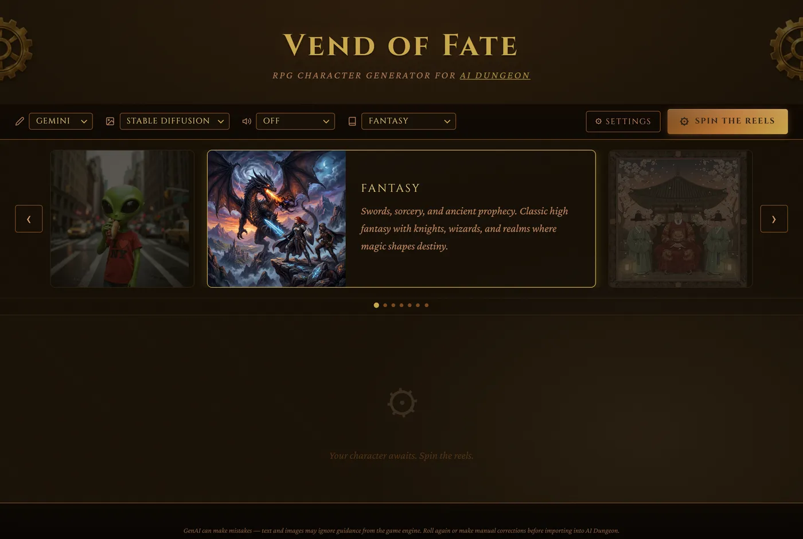
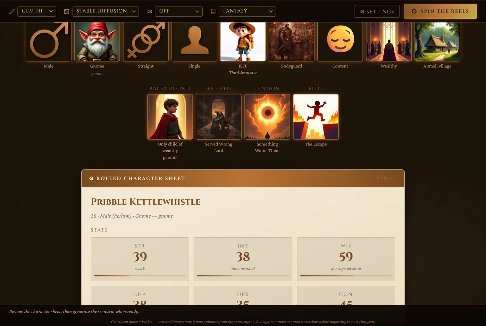
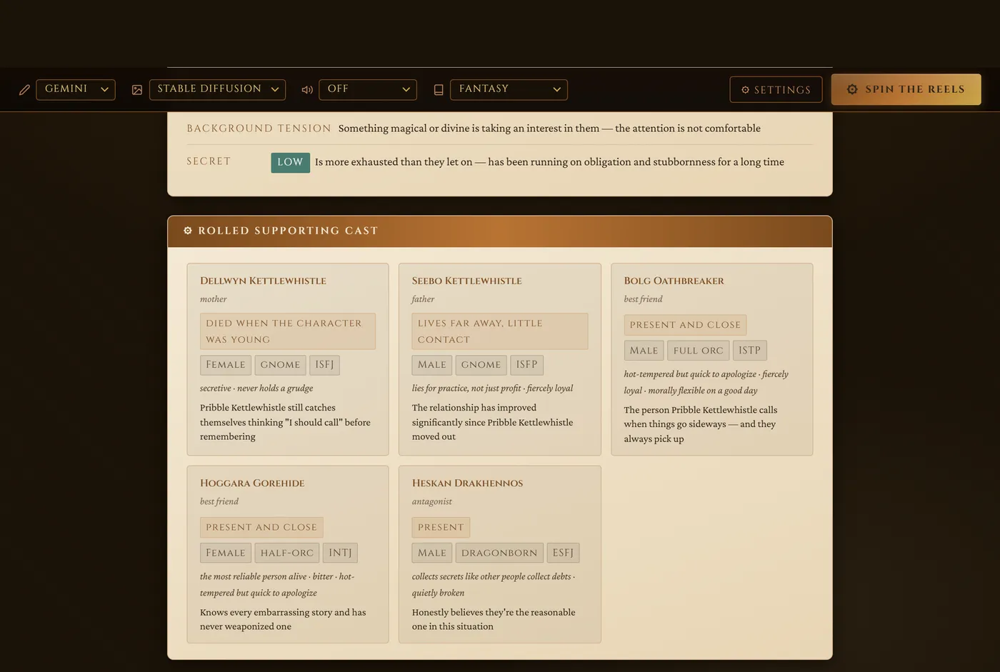
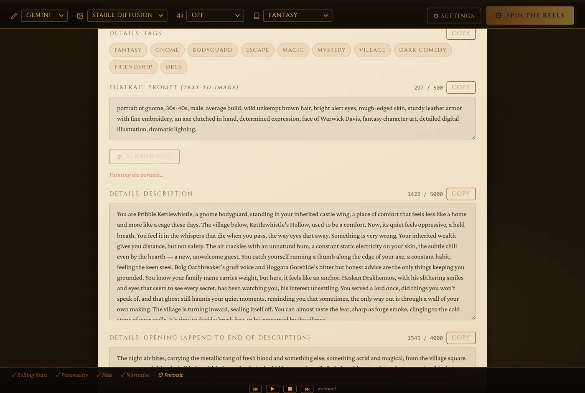
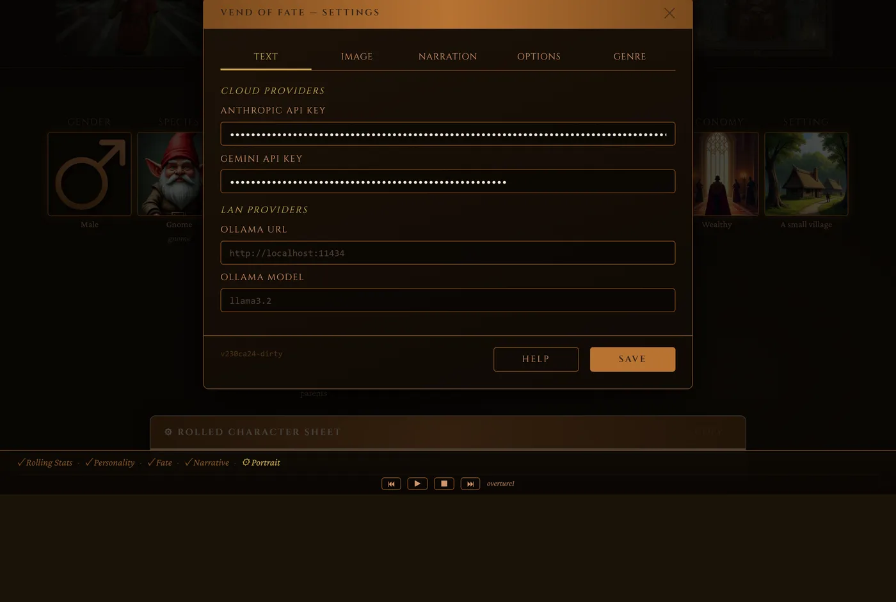

# FateVend — RPG Character Generator

A personality-first RPG character generator for AI Dungeon scenarios. Rolls stats, seeds a full character skeleton (protagonist + a supporting cast of NPCs) from curated tables, then calls an AI text provider (Claude, Gemini, or a local Ollama model) to generate terse behavioral prose — character entries, a scenario description, opening, plot components, text-to-image prompts, and tags — ready to export directly into AI Dungeon.

Seven built-in genres:
- **Modern**
- **Fantasy**
- **Sci-Fi**
- **Paleolithic**
- **Manga (Osaka Highschool 1987)**
- **Joseon Dynasty**
- **Nihongi (Ancient Japan)**

…plus **importable genre packs**: a genre is a pure-data pack (a `manifest.json`,
or a `.zip` with its own icons and music) that you can add at runtime from
**Settings → Genre Packs** — no source edits, no rebuild. See
[Genre packs](#genre-packs) below.

## Screenshots

<table>
<tr>
<td align="center" width="50%"><br><sub>Pick a genre from the carousel</sub></td>
<td align="center" width="50%"><br><sub>Spin the reels — roll a character skeleton</sub></td>
</tr>
<tr>
<td align="center"><br><sub>…and a full supporting cast (concrete races, MBTI, traits)</sub></td>
<td align="center"><br><sub>Generate the full AI Dungeon scenario + portrait</sub></td>
</tr>
</table>

<p align="center"><br><sub>Settings — bring your own text, image, and narration providers</sub></p>

## Prerequisites
- A laptop, PC or server to serve the HTML/JS/images.  Should work on any OS.
- An AI text provider
  - Ollama (local or on LAN)
    - https://ollama.com/
  - Claude.ai cloud API key
    - https://platform.claude.com/settings/keys
  - Google Gemini cloud API key (Recommended for best creativity, even in free tier)
    - https://aistudio.google.com/api-keys

### Optional
- AI Dungeon account
  - You could use the tool to generate scenarios for other games.  The tool only needs account credentials to auto import the custom scenario.
- An AI text-to-image provider
  - Stable Diffusion WebUI Forge (local or on LAN) with a good model, such as Flux1-dev
    - [Stable Diffusion WebUI Forge](https://github.com/lllyasviel/stable-diffusion-webui-forge)
    - [flux1-dev-bnb-nf4-v2.safetensors](https://huggingface.co/lllyasviel/flux1-dev-bnb-nf4/blob/main/flux1-dev-bnb-nf4-v2.safetensors)
  - Stability.ai cloud API key
    - https://platform.stability.ai/account/credits
- A TTS provider
  - Browser built-in
  - Kokoro TTS (local or LAN) (Recommended)
    - https://github.com/remsky/Kokoro-FastAPI
  - OpenAI TTS cloud API key
- Auto Importer (an external script) requires Node.js, Playwright, and Chromium

## Quick start

### Install
```bash
git clone fatevend.git
cd web
bash serve.sh
```

### Start server
`serve.sh` writes `generator/config.js` from your `.env`, starts a Python HTTP server on `:8080`, and (if Node is installed) starts the AI Dungeon import server on `:7432`.  Note that if there is already something running on port 8080, it will move to the next available port, so watch the console output for the actual port used.

#### Optional: run as a systemd service (Linux)
To keep `serve.sh` running in the background and auto-restart on boot/failure:
```bash
sudo bash deploy/install.sh
```
This fills in `deploy/fatevend.service`'s user and repo path automatically (using whoever ran `sudo`, or `sudo bash deploy/install.sh <username>` to specify one) and installs/enables/starts it. Safe to re-run any time (e.g. after moving the repo) — it just reinstalls and restarts. Logs via `journalctl -u fatevend -f`. Stop/restart with `sudo systemctl stop|restart fatevend`.

### Open Web Tool
- Open `http://localhost:8080/` in a browser. 
- Enter at least one text AI key in **Settings**
- Choose a genre
- Click **Spin the Reels**.
- When the slot machine UI completes, a scenario template is generated.
- If it looks interesting, Click **Generate Scenario**.
- Wait a couple minutes to generate the text and, if an image provider is defined, a protagonist portrait.
  - Adjust the Portrait Prompt and click Generate Portrait as needed.
  - Click Generate on each NPC's portrait
- If a Narration Provider is defined, you can listen to the generated scenario.

#### Importing the scenario into AI Dungeon
There are a few ways to use the results:
- Open both the tool and AI Dungeon in separate browser tabs and use each section's Copy button to copy and paste into the game.
  - Available on all platforms
- Open the tool side-by-side with AI Dungeon and use each section's Copy button to copy and paste into the game.
  - Available on desktop
- ⚙ Copy Full Text To Clipboard (JSON)
  - This is great to capture the story for editing.
  - Available on all platforms
- ↓ Download Package (.zip)
  - This is great to capture the story for later editing while on mobile, or use in other games.
  - Available on all platforms
- ↑ Import to AI Dungeon
  - This option is only available on localhost because of its dependence on Playwright and Chromium.
  - Requires your AI Dungeon credentials

The app must be served over HTTP (via `serve.sh` or any static server) — the ES
modules won't load from a `file://` URL. Keys can still be entered manually in
**Settings** instead of via `.env`.

## API keys

| Key | Provider | Used for |
|-----|----------|----------|
| `ANTHROPIC_API_KEY` | [console.anthropic.com](https://console.anthropic.com) | Text generation (Claude) |
| `GEMINI_API_KEY` | [aistudio.google.com](https://aistudio.google.com/app/apikey) | Text generation (Gemini) |
| `OLLAMA_URL` / `OLLAMA_MODEL` | Local/LAN [Ollama](https://ollama.com/) | Text generation (local, no key) |
| `STABILITY_API_KEY` | [platform.stability.ai](https://platform.stability.ai) | Portrait generation (cloud) |
| `SD_URL` | Local Stable Diffusion WebUI (Forge/A1111) | Portrait generation (local, takes priority) |
| `TTS_KOKORO_URL` | Local/LAN [Kokoro-FastAPI](https://github.com/remsky/Kokoro-FastAPI) | Narration (local TTS) |
| `TTS_OPENAI_KEY` | [platform.openai.com](https://platform.openai.com) | Narration (OpenAI TTS) |
| `AIDUNGEON_EMAIL` / `AIDUNGEON_PASSWORD` | AI Dungeon account | Playwright importer login |
| `NSFW_IMAGE_PROMPT_SUFFIX` | — | Appended to portrait prompts when NSFW is enabled |

All keys are optional except **at least one text provider** (Anthropic, Gemini, or Ollama). Add them to a `.env` file at the project root (see `.env.example`), or enter them in the **Settings** panel in the app. `serve.sh` reads `.env` and writes `generator/config.js` (gitignored) so the browser can pick them up without the `.env` itself ever being served. Click **? Getting API Keys** in Settings for step-by-step instructions.

## AI Dungeon import

After generating a scenario you can export it directly into AI Dungeon automatically.

### One-click import (requires Node + Playwright)

```bash
# Install Playwright once
npm install
npx playwright install chromium

# Start the import server alongside serve.sh (serve.sh does this automatically)
node web/tools/aidungeon-server.mjs
```

With the server running, an **↑ Import to AI Dungeon** button appears below the Download button after each generation. Click it — a browser window opens and fills in the scenario title, description, plot components, story cards, and portrait automatically.

### Manual import (download package first)

```bash
node web/tools/aidungeon-importer.mjs \
  --input <path-to-extracted-package-folder> \
  --headed \
  --slowmo 200
```

The package folder comes from **↓ Download Package (.zip)** in the web app. It contains `scenario.json` and `portrait.png`.

### What gets imported

| AI Dungeon field | Source |
|-----------------|--------|
| Title | `scenario.title` |
| Description | `scenario.description` |
| Opening: Story | description + opening |
| Story Summary | `scenario.opening` |
| Plot Essentials | `scenario.plotEssentials` |
| Author's Note | `scenario.authorNote` |
| Story Cards | one per character (name, description, trigger words), plus the genre's static lore cards (locations, factions, classes, races…) |
| Portrait | `portrait.png` |

## TTS narration

Select a voice provider in **Settings → Narration**: Browser (built-in), Kokoro (local LAN endpoint), or OpenAI TTS. Speaker buttons appear on all prose fields. **Narrate All** reads the full sheet sequentially.

## Genre packs

A genre is entirely **data**, so a new playable genre can be shipped as a
self-contained **pack** and imported at runtime — no source edits, no rebuild.
A pack is either:

- a single **`manifest.json`** (all data inline, reusing icons from built-in genres), or
- a **`.zip`** containing `manifest.json` plus optional `icons/` and `audio/`
  folders (so the pack brings its own slot-machine art, carousel cover, and BGM).

Packs carry **no executable code** — only JSON data and image/audio assets — so
importing one can't run arbitrary JavaScript.

**To install:** open **Settings → Genre Packs**, choose a `.json` or `.zip`
file, and the new genre appears in the carousel immediately. Installed packs are
stored in the browser (IndexedDB) and reload automatically; each has a **Remove**
button.

**To author one:** the fastest start is an existing example in `web/genre-packs/`:

- `sample-neon-drift.json` — a JSON-only pack (reuses Sci-Fi's art via the
  optional `iconBase` field).
- `example-pirate-cove.zip` + `build-example-pack.py` — a self-contained `.zip`
  with bundled icons and audio; the Python script builds it and doubles as a
  worked template.

The full pack format, loader/registration internals, and authoring guide are in
[`.claude/docs/features/genre-packs/DESIGN.md`](.claude/docs/features/genre-packs/DESIGN.md).

## CLI usage

FateVend has a command-line interface that shares the same generator engine as
the web app (pick a genre and provider, or roll skeleton-only with no API call).
See **[docs/CLI.md](docs/CLI.md)**.

## Contributing

Project structure, the test suite (`npm test`), the generator API, and a
step-by-step guide to adding a new genre are in
**[CONTRIBUTING.md](CONTRIBUTING.md)**.

## License

MIT — see [LICENSE](LICENSE). Some bundled audio/image assets are used under
their own separate licenses (Flaticon icons, AI-generated art, Pixabay audio) —
see [CREDITS.md](CREDITS.md) for attribution and sourcing.
